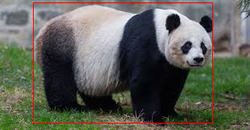
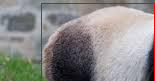

# Introduction
 
 This tool help you to divide your images and annotations into patches  
 ...when the images are tooooooo <font size=5>big</font>.

 For example, we are going to divide this image into 4 patches:  
 <center></center>  
 and the first patch looks like this:  
 <center></center>


# Usage
```
$ python crop_image_and_objects.py --data_dir dataset --mode voc --h_slice 2 --w slice 2
```
The directory _**dataset**_ contains all the images and corresponding annotations, and the script will create directories recursively as below.
```
dataset
├── voc
│   ├── images
│   └── labels
└── yolo
    ├── images
    └── labels
```
Now this script supports mode _**voc**_ and _**yolo**_. For more information, please type:
```
$ python crop_image_and_objects.py --help
```